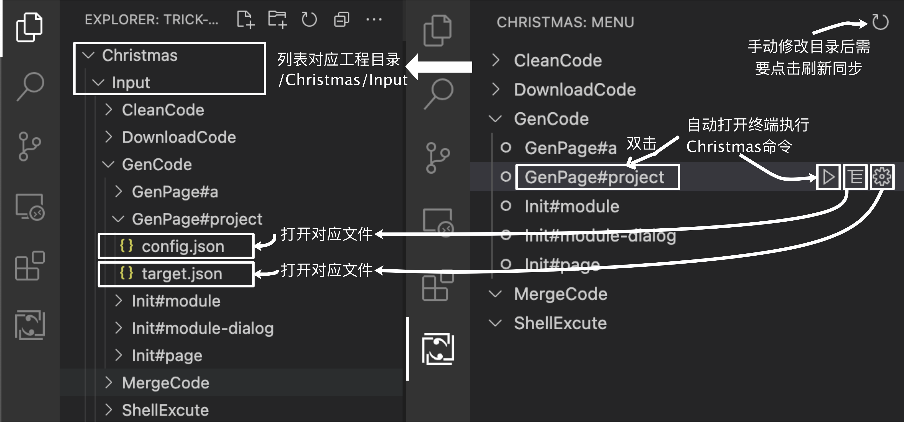
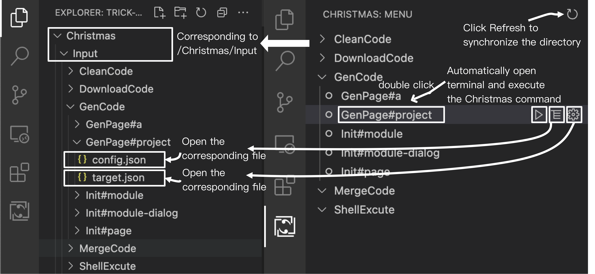

# Christmas

这是一个Christmas工具的VScode插件，Christmas是一个通用代码生成器。使用插件前，需要保证工程目录的一级目录包含Christmas工具，因为插件实质上是通过命令行操作Christmas工具的。

**[停止重构出品](https://stoprefactoring.com)**

A VScode extension for the Christmas tool, which is a generic code generator. Before using the extension, you need to ensure that the first level of the project directory contains the Christmas tool, because The extension essentially operates the Christmas tool from the command line.

**[Stop refactoring production](https://stoprefactoring.com)**

---

## 关于Christmas工具   About Christmas Tools

Christmas含有五大功能
- GenCode：通过代码模板生成代码
- MergeCode：从现有代码剪切合并代码，改变代码结构
- CleanCode：清理/备份文件、目录
- DownloadCode：下载代码
- ShellExcute：shell命令行编排

[更多Christams信息](https://stoprefactoring.com/#content@content#framework/christmas/)

Christmas contains five major functions
- GenCode: Generate code from code templates
- MergeCode: Cut and merge code from existing code , for change the code structure
- CleanCode: Clean up/Back up files or directories
- DownloadCode: download code
- ShellExcute: shell command line programming

[more Christams information](https://stoprefactoring.com/#content@content#framework/christmas/)

---

## 插件使用 Extension Use

当工程目录的一级目录含有Christams时，插件会自动启动。

> 工程目录中的Christmas工具必须是2.0或以上版本。

The extension is automatically started when the first level of the project directory contains Christams.

> The Christmas tool in the project directory must be version 2.0 or higher.

---

## 插件版本信息 Extension Release Notes

### 1.0.0

初始版本

Initial release

